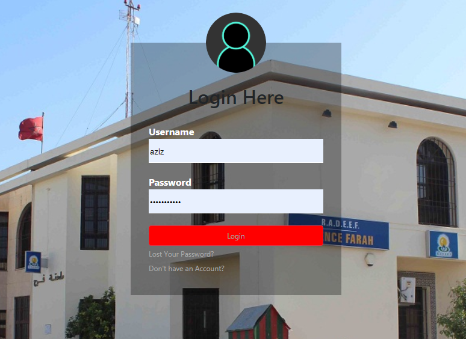
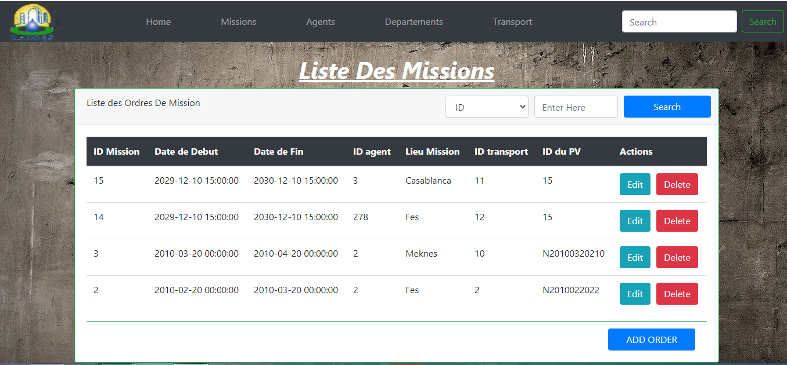

# crappy-phpapp-
Mission orders Application

******************************************************************
 THIS IS A README FILE FOR ANYONE WHO WANTS A CRAPPY PHPAPP FOR CLASS 
 **************************************************************
  
 THIS app contains a database 5  which has 7 tables : affecter - agent - departement - mission - pv - transport - users
 
 
 ---------------------- PAGE SESSION : ---------------------
 
 simple Authentification page with a background picture 
 

 
 
  ---------------------- PAGE HOME : ---------------------
  
  Main page that has a button that takes u to a list of missions
  
  
  
  --------------------- PAGE MISSIONS : -------------------
   
   A list of all missions that the admin added 
     
   
   
   contains : adding  - deleting - searching options 
   
   Adding Mission form
    
   
   
   Editing mission form
   
   
   
   
   -----------------------------------------------------------
   
   All the other pages have the same stuff : editing - adding - searchin - deleting
